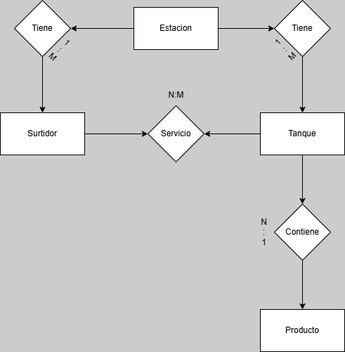

# 📊 Proyecto de Control de Gasolineras - Spring Boot

## 📑 Descripción del Proyecto
Este proyecto es una aplicación desarrollada con **Spring Boot** para gestionar y monitorear estaciones de servicio, tanques y surtidores de una empresa de gasolineras. Permite registrar y controlar los servicios realizados, el estado de los surtidores y la cantidad de combustible almacenada en los tanques.

## 🛠️ Tecnologías Utilizadas
- **Java** y **Spring Boot** para el backend.
- **JPA** y **Hibernate** para la persistencia de datos.
- **MySQL** como base de datos relacional.
- **Lombok** para reducir la verbosidad del código.
- **Spring Web** para la creación de REST APIs.

## 📁 Diagrama Entidad-Relación (ERD)

## 🗂️ Clases y Atributos
### Estacion
- id: `Long`
- nombre: `String`
- direccion: `String`
- tanques: `List<Tanque>`
- surtidores: `List<Surtidor>`

### Surtidor
- id: `Long`
- estacion: `Estacion`
- numero: `Integer`
- estado: `EstadoSurtidor` (Enum)

### Tanque
- id: `Long`
- estacion: `Estacion`
- producto: `Producto`
- capacidad: `Integer`
- cantidad: `Double`

### Producto
- id: `Long`
- tipoCombustible: `String`
- precio: `Double`

### Servicio
- id: `Long`
- surtidor: `Surtidor`
- tanque: `Tanque`
- fecha: `LocalDateTime`
- cantidad: `Double`
- precio: `Double`

## 🌐 Proyecto Desplegado
El proyecto está desplegado en Render y puede probarse desde el siguiente enlace:

🔗 **[Demo del Proyecto](https://contoso-dyqk.onrender.com)**

> ⚠️ **Nota:** El servidor está en un plan gratuito de Render. Esto significa que, si no ha recibido solicitudes recientes, puede estar en modo "sleepy" y tardar varios segundos en responder la primera petición.

## 🌐 Endpoints REST
A continuación se detallan los endpoints disponibles por cada entidad:

### 📌 Estaciones
- **GET** `/api/estaciones/{id}` - Obtener los datos de la estación, sus surtidores, tanques y el produccto relacionado a cada tanque.

### 📌 Surtidores
- **POST** `/api/surtidores` - Crear un nuevo surtidor.
- **PUT** `/api/surtidores/{id}` - Actualizar un surtidor existente.
- **DELETE** `/api/surtidores/{id}` - Eliminar un surtidor.

### 📌 Tanques
- **GET** `/api/tanques/{id}` - Obtener un tanque por su ID.
- **GET** `/api/tanques?{tipoCombustible}&{idEstacion}` - Obtener un tanque por el tipo de combustible que contiene y la estacion en la que se encuentra
- **PUT** `/api/tanques/{id}` - Actualizar un tanque existente.

### 📌 Productos
- **GET** `/api/productos` - Obtiene el producto por el tipo de combustible utilizado y el id de la estacion. (Indicar en el cuerpo)
- **PUT** `/api/productos/{id}` - Actualizar un producto existente.

### 📌 Servicios
- **GET** `/api/servicios/{estacionId}` - Obtener todos los servicios.
- **POST** `/api/servicios` - Registrar un nuevo servicio.

## 🚀 Ejecución del Proyecto
1. Clonar el repositorio: `git clone <URL_DEL_REPOSITORIO>`
2. Configurar las credenciales de la base de datos en `application.properties`.
3. Ejecutar la aplicación desde el IDE o con `mvn spring-boot:run`.

## 📝 Notas Adicionales
- Asegúrate de tener instalado **Java 21** y **Maven**.
- La estructura del proyecto sigue el estándar de capas: **Controller**, **Service**, **Repository** y **Model**.

¡Si tienes alguna duda o sugerencia, no dudes en comentar! 😊

